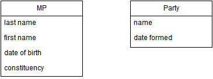
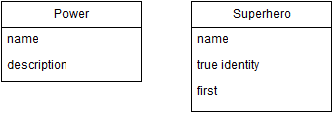

#Database Design - Relationships and Foreign Keys

Look at the following simple class diagrams. For each diagram. 
* Identify the relationships between the classes. Add multiplicity values.
* Create a physical data model that shows tables, foreign keys etc. 

 

**********

**********
