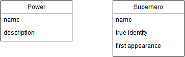
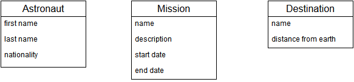

#Database Design - Relationships and Foreign Keys

Look at the following simple class diagrams. 
* Identify the relationships between the classes.
* Create a physical data model that shows database tables, foreign keys etc. 

